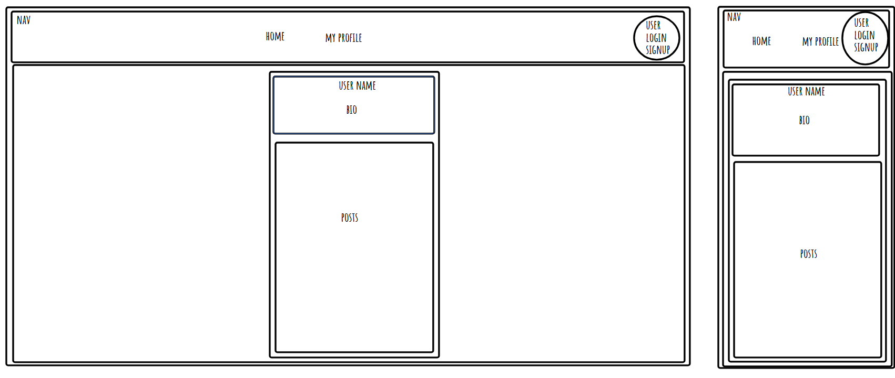
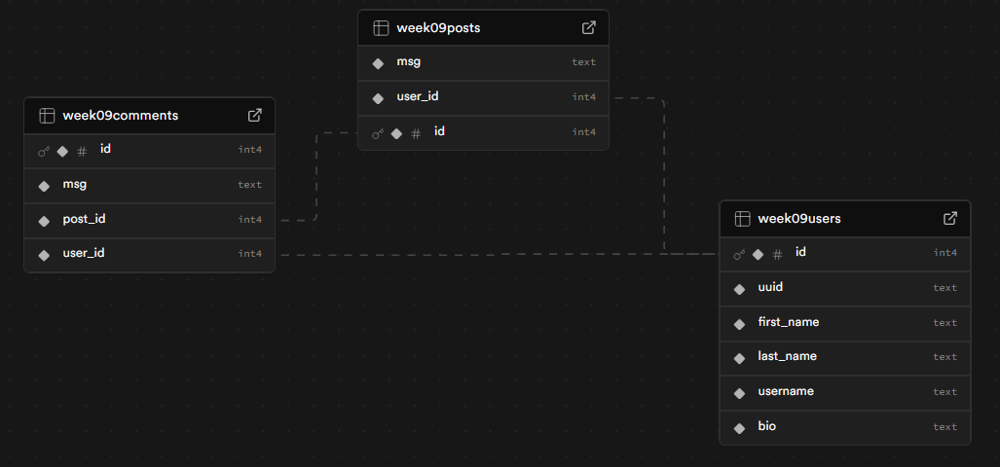

# week 9 assingment

## Reflection

- basic requirements

  - Set up user sign-up and user login using Clerk --done
  - Create and display an error/not found page if the user visits a page that doesn’t exist --done
  - Use 1 or more Radix UI Primitive component, or something similar --done
  - users to create a user profile --done
  - Enable users to create posts associated with their Clerk userId. Posts should be displayed on the user’s profile page --done

- stretch goals
  - Allow users to update their content --done
  - Allow users to delete their content --done
  - Allow users to view other profiles directly from posts they see on the global timeline, using a dynamic users route --done
  - Let users follow each other by establishing a follower and followee relationship between profiles.
  - Enable users to like posts by linking their user_id to the liked_post in a junction table.
  - Ensure that a user’s biography cannot be left blank --done
  - Create and display an error/not found page if the user visits another users profile that doesn’t exist --done

## References

- i use okso.app to help make a layout and site flow
- i use https://tailwindcss.504b.cc/ to help with styleing
